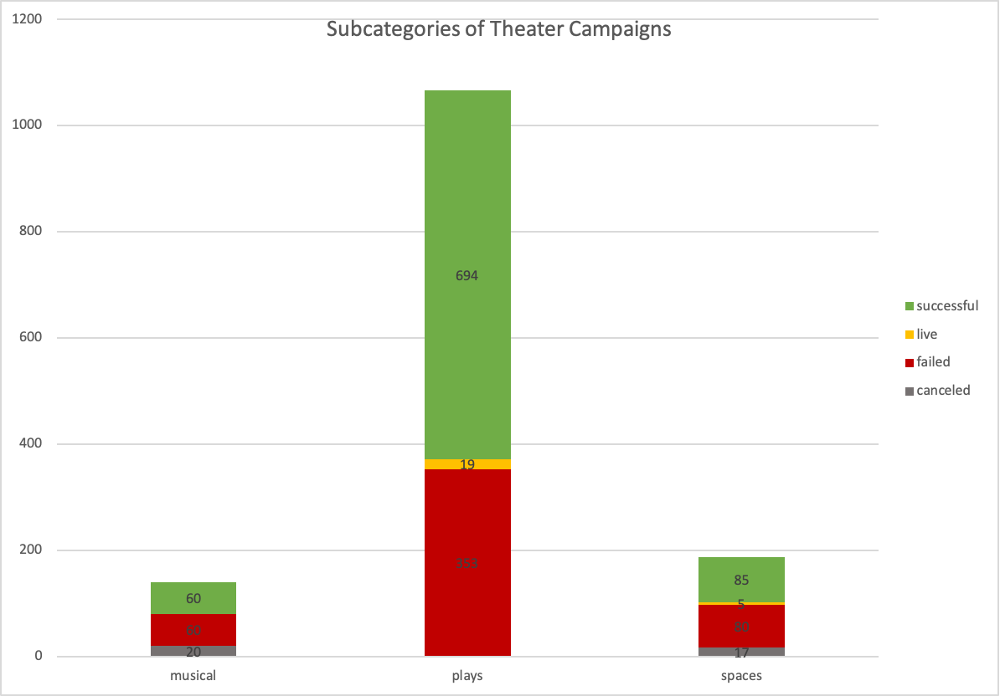
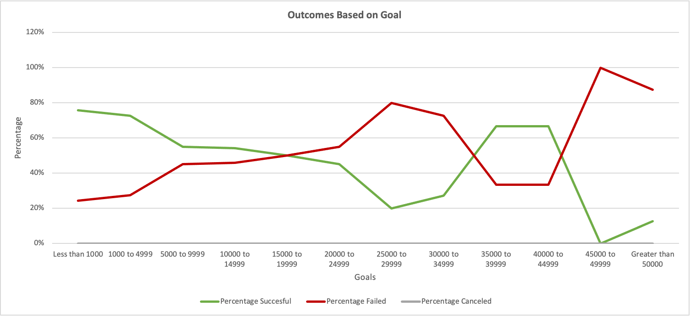
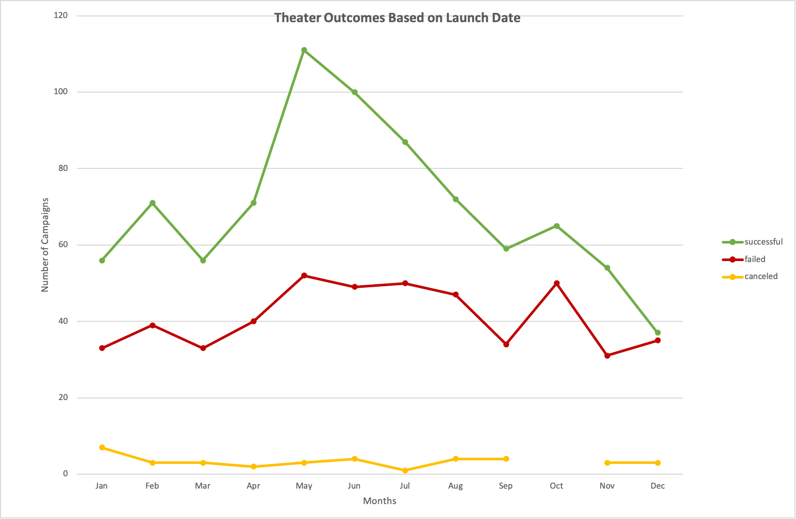

# Kickstarting with Excel

## Overview of Project
 
The study looked at a Kickstarter dataset of 4115 crowdfunding campaigns. It was used to analyze the effect of launch dates and funding goals on the outcomes of plays, a subcategory of theatre crowdfunding campaigns. 

The goal is to find specific factors that make crowdfunding campaigns for plays successful. 
This information will help Louise set up her own campaign for her play entitled, "Fever" which has an estimated budget of at least $10,000. 
 
## Analysis and Challenges
 
Of the 1393 crowdfunding campaigns for theatre, plays are the most popular with 1066 campaigns. 
</img>
 
The data shows that 65% of the campaigns for plays are successful in meeting their funding goal while only 33% have failed. 
 
</img>
 
</img>
 
</img>

### Analysis of Outcomes Based on Launch Date

### Analysis of Outcomes Based on Goals

### Challenges and Difficulties Encountered

## Results

- What are two conclusions you can draw about the Outcomes based on Launch Date?

- What can you conclude about the Outcomes based on Goals?

- What are some limitations of this dataset?

- What are some other possible tables and/or graphs that we could create?
