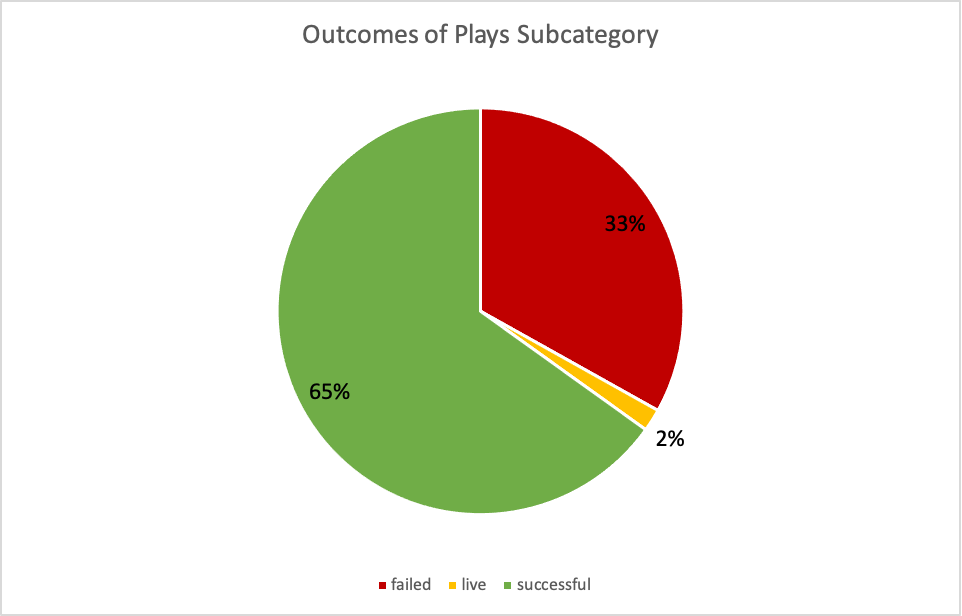
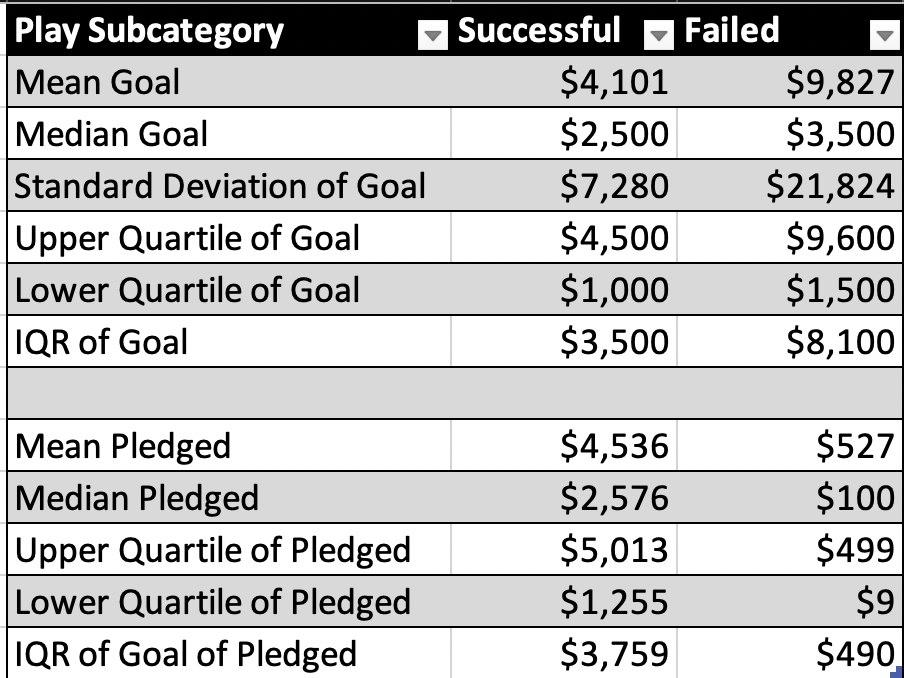

# Kickstarter Analysis

## Overview of Project

The study looked at a Kickstarter dataset of 4113 crowdfunding campaigns. It was used to analyze the effect of launch dates and funding goals on the outcomes of play crowdfunding campaigns, a subcategory of theater campaigns. 

The results from the analysis aim to help a client reach her funding goals by provding her with insights regarding the different factors that influence the outcomes of crowdfunding campaigns for plays. 

## Analysis and Challenges

### Analysis of the Plays Subcategory
 
</img>
 

Of the 1393 crowdfunding campaigns for theaters, plays are the most popular with a total of 1066 campaigns. This accounts for a little over 76% of all theater campaigns in the data. 

 
</img>
 

Apart from its popularity, plays are also largely successful. The data shows that 65% of the campaigns for plays were successful in meeting their funding goals while only 33% have failed. Meanwhile, only a very small 2% are still live. 

 
</img>
 

Based on the summary statistics above, successful campaigns for the plays subcategory have a mean goal of $4,101 that is only slightly exceeded by a mean pledge of $4,536. On the other hand, failed campaigns for the plays subcategory have a mean goal of $9,827 and a very low mean pledge of $527.

### Analysis of the Theater Outcomes Based on Launch Date
 
</img>
 

 The data illustrates how the number of successful theater campaigns have always excceded the number of failed theater campaigns in all 12 launch months of the year. This implies that regardless of their launch dates, more theater campaigns were able to meet their funding goals compared to those that were unable to. 

 

 The amount of successful theater campaigns, however, is not uniform throughout the year. The data shows that May has 111 successful campaigns, the highest number in all the 12 launch months. In the succeeding launch months, the amount of successful theatre campaigns gradually trends downward until it reaches its lowest point of 37 successful theater campaigns in Decemeber. One possible explanation is the way people's spending patterns change during the 4th quarter of the year. With more household expenses accompanying the holiday season, potential donors may have less to contriubute to play campaigns that launch during this time. 

### Analysis of Outcomes Based on Goals
 
</img>
 

The percentage of successfully funded campaigns tends to decrease as funding goals increase. The data shows that this is true for funding goals up to the range of 25000-29999. In the case of our client whose funding goal falls within the 10000-99999 range, she can expect about 54% of crowdfunding campaigns like hers to to be successful. 

### Challenges and Difficulties Encountered

One challenge was using the countifs function to manually populate each cell of the table used to create the "Outcomes Based on Goal" chart. Each cell on this table had to count the number of  campaigns after filtering for the plays subcatagory, the ouctome specified by the cell column and the goal range specified by the cell row. To overcome this tedious process, I populated every cell under the Number Successful columns first while making sure to lock the columns I filtered with the $ sign. This allowed me to simply autofill the other two columns (Number Failed and Number Canceled) while keeping the references to the cells I filtered the same. As a result, the other two columns were populated properly with minimal edits.

Another challenge was making sure that the months instead of individual dates were displayed on the x axis of the pivot chart entitled, "Theater Outcomes Based on Launch Date". This was overcome by right clicking on the rows of the pivot chart and by selecting group data. This condensed the number of successful, failed and cancelled outcomes to a per month basis which made trend analysis easier.

## Results

### Conclusions from Outcomes based on Launch Date

1) Theatre campaigns launched in May have the most number of success. Our client should consider launching her play campaign during this month especially since the plays subcategory comprises more than a quarter of theater campaigns. 

2) Our client should avoid launching her play campaign in the fourth quarter of the year. This period contains both the lowest number of successful theater campaigns (37 campaigns in December) and one of the highest number of unsuccessful theater campaigns (50 campaigns in October).

### Conclusions from the Outcomes based on Goals

1) Successful percentages of play campaigns fall with the rise in funding goals. Therefore, play campaigns that start with very high funding goals are usually unsuccessful in meeting them. Our client might want to reconsider her $10,000 goal since only around half of the campaigns of the same category and funding goal as her are successful. In addition, the summary statistics reveal that our client's $10,000 goal is much closer to the mean goal of failed play campaigns ($9,827) than it is to the mean goal of succesful play campaigns ($4,101). Before starting her campaign, she should be aware that the mean pledge for successful play campaigns is $4,536.

### Limitations of the Dataset

The data set does not provide insight into the reasons why certain campaigns are cancelled. These reasons can vary and can affect our classificaton of success and failure. Perhaps the owners of a campaign found alternative sources of funding for their project. In such cases, there was no need to continue with the kickstarter campaign since the financial goals were met. However, this does not necessarily mean that the campaign was unsuccessful. 

Another reason could be that some owners cancel their campaigns after being discourgaed by the slow rate of contributions from supporters. By prematurely cancelling a campaign before its deadline, we may understate the true failure rate of campaigns belonging to that category and level of funding goals. 

### Recommendations for other possible tables and/or graphs

It is recommended to create the same graphs such as "Outcomes based on Goal" and "Theater Outcomes Based on Launch Date" but with the country filter set to our client's specific country. This will help narrow down the outcomes of simmilar campaigns to her geographical region as potential donors from different parts of the world have varying preferences and economic situtions. 

Another table we can create is a line chart that depicts the Outcomes based on length of a campaign (the difference between the deadline and launch dates). Since current analysis has shown that some potential donors are more generous during certain times of the year, it is interesting to examine if they will necessarily contribute more if they are given more months in a year to do so.

